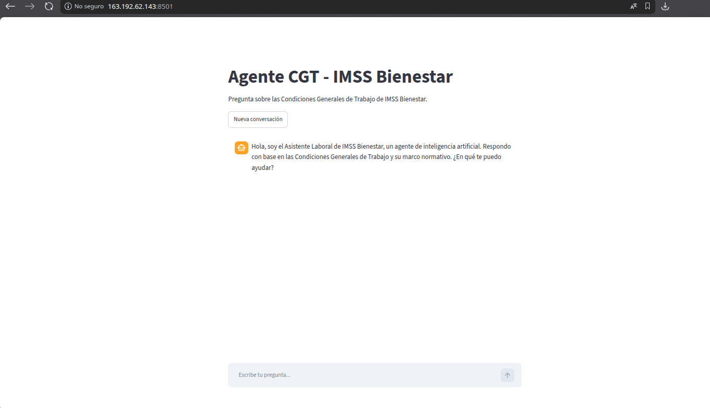
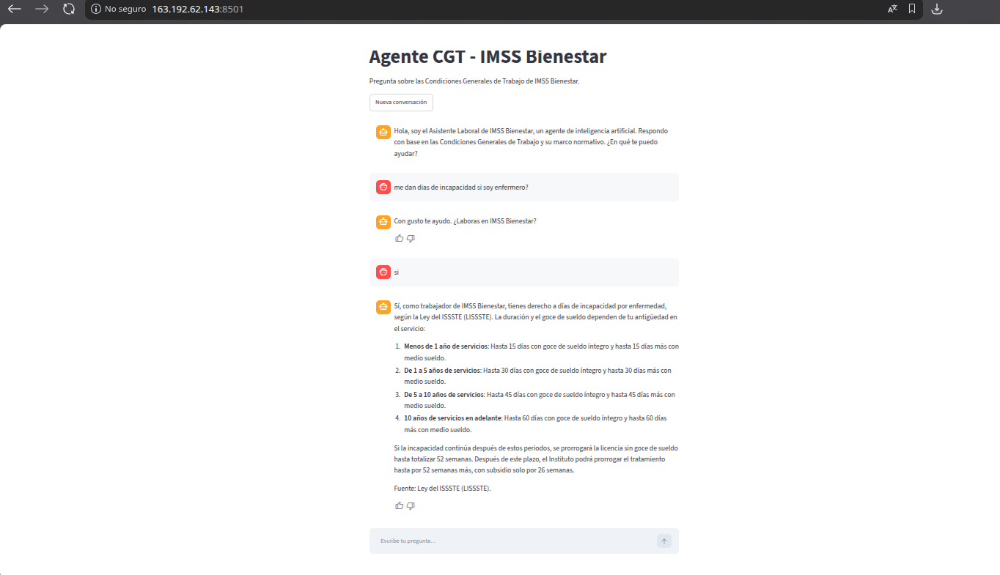
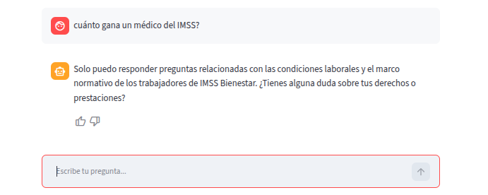

# Agente CGT — IMSS Bienestar



Agente de inteligencia artificial que responde preguntas sobre las
**Condiciones Generales de Trabajo (CGT) de IMSS Bienestar** y su marco
normativo, usando la técnica RAG (Retrieval-Augmented Generation):
las respuestas se basan únicamente en los documentos oficiales y citan
la fuente. Proyecto desarrollado para el desafío de Alura.


## Documentos que consulta

| Documento | Rol |
|---|---|
| Condiciones Generales de Trabajo IMSS Bienestar (CGT) | Documento base |
| Ley Federal de los Trabajadores al Servicio del Estado (LFTSE) | Marco legal |
| Ley del ISSSTE (LISSSTE) | Pensiones y seguridad social |
| Ley General de Responsabilidades Administrativas (LGRA) | Marco legal |
| Ley de Premios, Estímulos y Recompensas Civiles | Marco legal |

## Arquitectura

```
                    INGESTA (una sola vez)
┌─────────────┐   ┌───────────────┐   ┌──────────────────┐
│ PDFs en     │──▶│ Extracción y  │──▶│ Embeddings Cohere │
│ documentos/ │   │ división en   │   │ + base vectorial  │
└─────────────┘   │ chunks        │   │ ChromaDB local    │
                  │ (LangChain)   │   │ (chroma_db/)      │
                  └───────────────┘   └──────────────────┘

                    CONSULTA (cada pregunta)
┌──────────┐   ┌──────────────┐   ┌───────────────┐   ┌──────────┐
│ Pregunta │──▶│ Filtros y    │──▶│ Recuperación  │──▶│ LLM       │
│ del      │   │ verificación │   │ de los chunks │   │ Cohere    │
│ usuario  │   │ (safeguard)  │   │ más parecidos │   │ command-r │
│(Streamlit│   └──────────────┘   │ (ChromaDB)    │   │ -plus     │
│  chat)   │                      └───────────────┘   └────┬─────┘
└──────────┘                                               │
      ▲                 Respuesta con cita de fuente       │
      └────────────────────────────────────────────────────┘
```

**Componentes:**

- **Ingesta** (`src/ingestor.py`): lee todos los PDFs de `documentos/`,
  divide el texto en fragmentos de 1000 caracteres (con traslape de
  200) y los guarda con embeddings de Cohere
  (`embed-multilingual-v3.0`) en una base vectorial ChromaDB local.
  Cada fragmento conserva el documento de origen como metadato, lo que
  permite citar la fuente.
- **Agente** (`src/app.py`): interfaz de chat en Streamlit con memoria
  conversacional. Cada pregunta recupera los 8 fragmentos más
  relevantes y los pasa al LLM de Cohere (`command-a-03-2025`)
  junto con el historial.
- **Safeguard en capas**: el agente solo atiende temas laborales de
  IMSS Bienestar. Un filtro de palabras clave rechaza preguntas sobre
  otras instituciones (IMSS, PEMEX, etc.) sin gastar llamadas a la
  API; el LLM rechaza los temas ajenos al ámbito laboral; y si la
  pregunta no aclara la institución, el agente pregunta primero
  "¿Laboras en IMSS Bienestar?" y recuerda la respuesta el resto de
  la conversación.

## Módulos de mantenimiento

Además del agente, el proyecto incluye 5 módulos para mantenerlo
funcionando y mejorarlo con el tiempo:

- **Pipeline de actualización de documentos** (`src/actualizador.py`):
  detecta automáticamente documentos nuevos, modificados o eliminados en
  `documentos/` (comparando huellas contra el manifiesto) y reingesta
  SOLO los documentos afectados en ChromaDB, sin reprocesar el resto.
- **Curaduría de contenido** (`src/actualizador.py`): compara las
  versiones actuales de los PDFs contra lo indexado y genera un reporte
  de sincronización (`logs/reporte_curaduria.txt`) para revisión humana.
- **Monitoreo de calidad** (`src/monitor.py` + `src/reporte_calidad.py`):
  cada pregunta queda registrada en `logs/metricas.jsonl` (con
  trazabilidad completa: pregunta, respuesta, documentos usados, tipo de
  respuesta, tiempo y calificación 👍/👎) y se sincroniza con OCI Object
  Storage; `reporte_calidad.py` genera un resumen con % de preguntas
  respondidas vs. bloqueadas, tiempo promedio y feedback negativo.
- **Ciclo de mejora** (`src/analizador_gaps.py`): lee las métricas,
  agrupa por tema las preguntas que el agente no pudo responder y
  sugiere qué tipo de documento cubriría cada vacío
  (`logs/gaps_detectados.txt`).
- **Evaluador de modelo** (`src/evaluador_modelo.py`): corre la cadena
  RAG directamente (sin Streamlit) contra 10 preguntas fijas con
  criterios definidos, calcula PASS/FAIL y una puntuación total —
  útil para comparar versiones del modelo o de sus parámetros.

## Ejemplos de preguntas y respuestas

**Pregunta:** ¿Cuántos días de vacaciones corresponden a un trabajador según la CGT?

> Según las Condiciones Generales de Trabajo (CGT) de IMSS Bienestar,
> en el Artículo 39 se establece que las personas trabajadoras de base
> que tengan más de seis meses continuos de servicios disfrutarán de
> dos periodos anuales de vacaciones de diez días laborables cada uno.

**Pregunta:** ¿Cuántos días de aguinaldo me corresponden?

> De acuerdo con las Condiciones Generales de Trabajo de IMSS
> Bienestar (CGT), los trabajadores tienen derecho a un aguinaldo
> anual equivalente a 40 días de salario, como mínimo, sin
> deducciones. Este pago se divide en dos partes: el 50% antes del 15
> de diciembre...

**Pregunta:** ¿Qué dice la ley sobre las pensiones por cesantía en edad avanzada?

> La Ley del ISSSTE (LISSSTE) establece que la cesantía en edad
> avanzada se define como la situación en la que un trabajador queda
> privado de trabajo a partir de los sesenta años de edad (Artículo
> 84). Para tener derecho a la pensión, el trabajador debe cumplir
> con ciertos requisitos de edad y años de servicio...

**Pregunta fuera de tema:** ¿Cuál es la receta de la carne asada?

> Solo puedo responder preguntas relacionadas con las condiciones
> laborales y el marco normativo de los trabajadores de IMSS
> Bienestar. ¿Tienes alguna duda sobre tus derechos o prestaciones?

## Cómo ejecutarlo

Requisitos: Python 3.10+ y una API key de Cohere
(gratuita en [dashboard.cohere.com](https://dashboard.cohere.com/api-keys)).

```bash
# 1. Clonar el repositorio
git clone https://github.com/sarg67/Agente-CGT.git
cd Agente-CGT

# 2. Crear y activar el entorno virtual
python3 -m venv venv
source venv/bin/activate

# 3. Instalar dependencias
pip install -r requirements.txt

# 4. Configurar la API key (copiar la plantilla y editarla)
cp .env.example .env
# editar .env y reemplazar el valor de COHERE_API_KEY con tu key real

# 5. Crear la base vectorial (una sola vez; tarda ~10 min
#    con API key de prueba por los límites de velocidad)
python src/ingestor.py

# 6. Levantar el agente
streamlit run src/app.py
```

Abre `http://localhost:8501` en el navegador y pregunta.

**Nota:** las API keys de prueba (Trial) de Cohere tienen límite de
llamadas por minuto y por mes; el ingestor ya lo maneja procesando
por lotes con pausas.

## Mantenimiento: actualizar los documentos

Cuando un PDF se agregue, cambie o elimine en `documentos/`, basta con
correr de nuevo:

```bash
python src/ingestor.py
```

El ingestor detecta automáticamente si los documentos cambiaron
(compara su huella digital contra la última ingesta registrada en
`manifiesto_ingesta.json`): si no hay cambios termina en segundos sin
consumir API, y si los hay, reconstruye la base vectorial completa
sin duplicados. Para automatizarlo como rutina periódica, se puede
programar ese comando con `cron` en el servidor (ver sección de
deploy).

## Dashboard de monitoreo

Además del chat, hay un dashboard de Streamlit (`src/dashboard.py`) que
visualiza las métricas de uso registradas en `logs/metricas.jsonl`
(latencia, preguntas respondidas vs. bloqueadas, feedback, preguntas
recientes con su respuesta y documentos usados). Corre en un puerto
separado del agente, para no interferir con él:

```bash
streamlit run src/dashboard.py --server.port 8502
```

## Deploy en OCI

El agente está desplegado en producción en Oracle Cloud Infrastructure:

**URL pública:** http://163.192.62.143:8501

| Respuesta con cita de fuente | Safeguard (tema ajeno) |
|---|---|
|  |  |

**Servicios de OCI usados:**

- **OCI Compute** (VM Always Free, `E2.1.Micro`): corre la app de
  Streamlit como servicio systemd.
- **OCI Object Storage**: almacena los logs de métricas
  (`logs/metricas.jsonl`) como respaldo en la nube.
- **OCI Vault**: guarda de forma segura la API key de Cohere.
- **GitHub Actions (CI/CD)**: despliega automáticamente a la VM con
  cada push a `main`.

## Estructura del proyecto

```
├── documentos/          # PDFs fuente (CGT + 4 leyes)
├── assets/              # Capturas usadas en este README
├── src/
│   ├── ingestor.py         # Ingesta: PDFs → chunks → ChromaDB
│   ├── reocr_cgt.py        # Re-OCR en español del CGT (PDF escaneado)
│   ├── app.py              # Agente: chat Streamlit + RAG + safeguard
│   ├── actualizador.py     # Pipeline de actualización y curaduría
│   ├── monitor.py          # Sincroniza logs/metricas.jsonl con OCI
│   ├── reporte_calidad.py  # Reporte de calidad y uso (CLI)
│   ├── analizador_gaps.py  # Ciclo de mejora: vacíos de conocimiento
│   ├── evaluador_modelo.py # Evaluador de modelo (10 preguntas fijas)
│   └── dashboard.py        # Dashboard de monitoreo (Streamlit, :8502)
├── requirements.txt
├── .env.example         # Plantilla de variables de entorno
└── chroma_db/           # Base vectorial (se genera con el ingestor)
```

## Autor

- GitHub: [sarg67](https://github.com/sarg67)
- Proyecto desarrollado para el Challenge Alura + Oracle.
